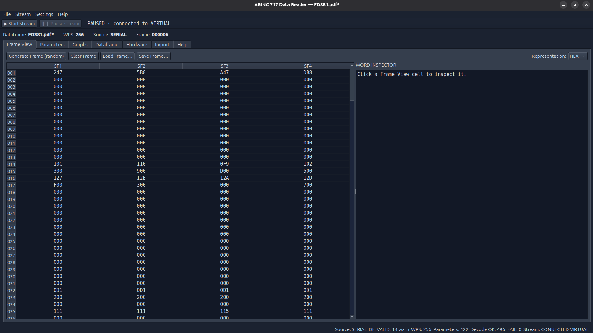
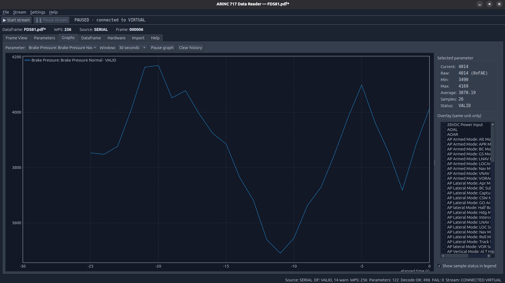
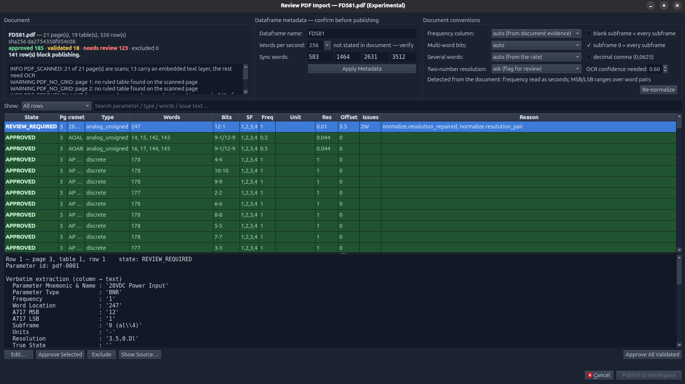

# ARINC 717 Reader

Simulation-first desktop application for ARINC 717 flight data: dataframe import
(`.adb`, PDF), raw frame inspection and editing, parameter decoding to
engineering values, a live word stream from an STM32 hardware-in-the-loop
simulator (or an in-process virtual device) with per-subframe decoding,
graphs, session recording and replay, ten colour themes from Light to Cockpit (Settings menu), and an
in-app user guide (Help tab, F1).



*The main window: stream toolbar, header line, the Frame View of a paused virtual stream, and the status bar (dark theme).*


The implementation specification is `ARINC717_READER_SYSTEM_DESIGN_v2.md`
(revision 2: the v1 sections unchanged plus the live streaming, graphing and
recording sections). Full documentation — user guide, data model, decoder, ADB
format, PDF import, the SIM-A717 protocol, the live path, architecture and
troubleshooting — is in [`docs/`](docs/README.md).

## Setup

```bash
python3 -m venv .venv
.venv/bin/pip install -e .[dev]
```

## Run the application

```bash
.venv/bin/arinc717-reader                        # start empty
.venv/bin/arinc717-reader examples/demo_256wps.adb   # start with the demo dataframe
```

Or without installing: `.venv/bin/python -m arinc717_reader`.

A demo 256 WPS dataframe is bundled at `examples/demo_256wps.adb`
(regenerate with `.venv/bin/python examples/make_demo_adb.py`). The Import
page also has a "Load Demo Dataframe" button. The same dataframe rendered as
a PDF dataframe document is at `examples/demo_256wps.pdf` (regenerate with
`.venv/bin/python examples/make_demo_pdf.py`) for trying the PDF importer.

## Live stream, graphs, recording



*Graphs: a 30-second window of one parameter, statistics, and the same-unit overlay list.*


The **Hardware** page connects to an STM32F103 + FTDI board running the
project's `SIM-A717 v1` stream emulator (spec v2 §26A–§26J), or to a virtual
device that runs the same emulation in-process: press **▶ Start stream** in
the toolbar (it connects to the port chosen on the Hardware page, `VIRTUAL`
by default). The stream is synchronised into subframes, the Frame View
updates one subframe column per second (the other columns keep their last
words) with explicit received / pending / invalid / missing states, every
subframe is decoded on arrival into timestamped samples, and the **Graphs**
page plots them with time windows, statistics and same-unit overlays.
**❚❚ Pause stream** holds the frame so it can be inspected and edited. The
Hardware page also shows stream diagnostics and injects faults (dropped
words or subframes, bad CRC, wrong WPS, pauses, disconnects). File → Record
Session… / Replay Session… record sessions to `.a717session` files and
replay them through the same decoder and graph pipeline. By default the PC generates
engineering-coherent signals (random walk, sine, ramp, step, scripted per
parameter) and uploads them to the device; raw device modes exist for
parser testing.

The firmware (C, `make` with `arm-none-eabi-gcc`) is in
[`firmware/stm32f103_sim_a717/`](firmware/stm32f103_sim_a717/README.md); the
protocol is documented in [`docs/12-sim-a717-protocol.md`](docs/12-sim-a717-protocol.md)
and the live path in [`docs/13-live-streaming-graphs-recording.md`](docs/13-live-streaming-graphs-recording.md).
The STM32 UART stream is a simulation of a recorder bus, not an ARINC 717
electrical interface; real ABUS 717 acquisition remains a future source.

## Authoring a dataframe by hand

File → New Dataframe… (or the Dataframe / Import page buttons) creates an
empty dataframe with a name, WPS and sync words. On the Dataframe page, Add /
Edit / Duplicate / Remove and the ▲▼ buttons manage parameters; double-click a
parameter to edit it. The edit dialog derives the canonical type from the
source type exactly as the importer does, edits the mapping as one row per
segment (occurrence, sequence, subframes, word, LSB, MSB) and previews the
validator's verdict with "Check". Every committed edit re-decodes the current
frame immediately. Unexported edits show as `*` in the title bar; Export ADB
clears the marker. Edited parameters keep their preserved raw fields (legacy
flags, unknown settings columns) so the export still round-trips.

## Importing a dataframe PDF (experimental)



*The review dialog on the scanned CN235-220 document: every extracted row with its state and reason, the verbatim cells, and the conventions panel.*


File → Import PDF… (or the Import page) runs the Phase 8 pipeline on a
dataframe layout document, in the background with a progress dialog:

- **Born-digital pages** go through PyMuPDF's table finder.
- **Scanned pages** (an image covers the page) are rendered, deskewed, and the
  ruled grid is detected on the image; text comes from the page's embedded
  text layer when a scanner or Acrobat added one, otherwise from the optional
  OCR engine (`pip install rapidocr-onnxruntime`, or `.[ocr]`). Cells the
  OCR detector leaves empty get a recognition-only second pass. A page with
  neither text nor OCR is reported, never skipped silently. OCR takes roughly
  20 s per page on a CPU.

Column meaning comes from the table header through synonyms with a fuzzy
fallback for OCR noise ("Parameter Tvpe"); a stacked "Parameter Mnemonic &
Name" cell yields mnemonic (first line) and name. A row that only continues
text columns after a page break is merged into the previous row.

Every cell keeps page, bounding box, verbatim text, text source and OCR
confidence. Normalization never repairs ambiguity silently: explicit rules
cover word lists, word pairs ("14-15, 142-143" with MSB "9-1" / LSB "12-9"),
MSB/LSB or bit-range columns, subframes ("0 (all 4)"), an "offset,
resolution" pair in the resolution cell, and the frequency column, which is
read as Hz or as seconds between samples. Two document-wide conventions are
detected from evidence and reported (frequency unit from rate consistency,
the MSB/LSB word-pair layout when several rows use it); everything else that
needed an interpretation — an unknown type, a blank subframe, OCR digit
corrections such as "。" → "0" or "1S2" → "152", stray stamp marks, a
two-number resolution, an uneven sample spacing that hints at a misread word
number — is marked REVIEW_REQUIRED with the reason. Overlapping bit fields
are validator warnings shown on both rows.

Rows that normalize and validate without any issue are approved
automatically. The review dialog shows every row with its state and reason,
the verbatim cells, the interpretation, issues and history; it can render
the source page region, edit a row (same editor as the Dataframe page),
approve or exclude selected rows (filter, select the visible rows, approve),
confirm WPS and sync words, declare the document's conventions and
re-normalize, and finally publish the approved rows as the working dataframe
(marked unexported until Export ADB). Published parameters keep raw cells,
page, bbox, text source, interpretation and review history in their
provenance.

`examples/Scanned_from_UK_Lexmark03-12-2025-123425 (1) data frame.pdf` is a
real CN235-220 dataframe layout document (Flight Data Systems, 21 scanned
pages, 13 with a text layer). It imports in about 2.5 minutes with OCR;
`ImportProfile(page_range=(3, 13))` imports the text-layer pages in seconds.

## Standalone executable

See `packaging/README.md`: `packaging\build_windows.bat` on Windows or
`packaging/build.sh` on Linux produces `dist/ARINC717Reader/` with the
executable, the Qt plugins, PyMuPDF and the OCR models. Run the result with
`--selftest` to check it. `packaging\build_msi.bat` then wraps the Windows
folder into a single `.msi` installer (WiX Toolset; Start Menu shortcut, Apps &
Features entry, in-place upgrades).

## Run the tests

```bash
.venv/bin/python -m pytest
```

## Layout

- `arinc717_reader/domain/` — canonical models (dataframe, frame, engineering data)
- `arinc717_reader/decoder/` — bit extraction, segment assembly, type decoding, conversion
- `arinc717_reader/encoder/` — inverse path: engineering signals for the live stream and the scenario / closed-loop encoder used by the tests
- `arinc717_reader/dataframe/` — `.adb` codec, validator, SQLite repository, editor helpers
- `arinc717_reader/dataframe/pdf_importer/` — PDF pipeline: ingest, render, native and scanned extraction (`scan.py`: deskew, grid detection, text layer / OCR), normalize, review session, synthetic document generator for tests
- `arinc717_reader/sources/` — frame sources (random / manual / scenario / future ABUS hardware) and streaming sources: `stream_base.py`, `replay_source.py`
- `arinc717_reader/sources/serial/` — SIM-A717 v1 protocol, pyserial and in-memory transports, stream parser, synchronizer, subframe assembler, diagnostics, serial source, virtual STM32 device
- `arinc717_reader/streaming/` — parameter samples, sample bus, bounded time-series store, engineering signal generators
- `arinc717_reader/recording/` — session file format (JSON Lines) and recorder
- `arinc717_reader/state/`, `arinc717_reader/services/` — stores (dataframe, frame, engineering, stream) and application services (dataframe, frame, decoding, simulation, serial, streaming, recording)
- `arinc717_reader/ui/` — PySide6 GUI (observes stores only; contains no decode logic): Frame View, Parameters, Graphs (`ui/graph_view/`), Dataframe, Hardware (`ui/hardware/`), Import, Help (`ui/help/`, the in-app user guide), the stream Start / Pause toolbar (`ui/stream_controls.py`)
- `firmware/stm32f103_sim_a717/` — the STM32F103 stream emulator firmware (freestanding C, Makefile)
- `img/` — application screenshots used by the documentation and shown in the Help tab (bundled by the packaging spec)
