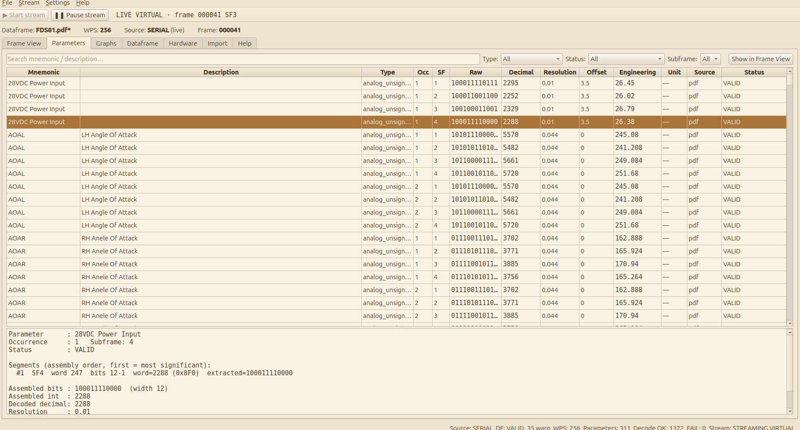

# 01 — Overview

## Purpose

Flight data recorders on aircraft such as the CN235 record an **ARINC 717**
data stream: a fixed pattern of 12-bit words whose meaning is defined by a
**dataframe** (also called a dataframe layout, interface control document, or
FDR parameter library). Without the dataframe the stream is just numbers;
with it, each group of bits becomes a named parameter with an engineering
value such as *pitch attitude = −30.096 deg*.

The ARINC 717 Reader is a desktop application that:

1. loads a dataframe from an existing `.adb` file (the database format of
   the AFDA flight-data software), from a dataframe document in PDF form,
   or from manual entry;
2. holds ARINC 717 data as a canonical frame of four subframes with a
   configurable number of words per second (256 is the primary target);
3. shows the raw frame in a **Frame View** with binary, octal, decimal and
   hexadecimal representations and lets the user edit individual words;
4. decodes every mapped parameter into raw bits, decoded decimal and
   engineering value, with a complete trace of how each value was derived;
5. produces frames without aircraft hardware: random words or hand-edited
   words in the Frame View, and, for the live stream, engineering values
   encoded into frames by the **parameter encoder** (the same encoder is the
   closed-loop check of the test suite and the selftest);
6. receives a **continuous word stream** over a serial port from an STM32
   hardware-in-the-loop simulator (or from an in-process virtual device),
   synchronises it into subframes, fills the Frame View progressively and
   decodes each subframe as it arrives into timestamped parameter samples;
7. **graphs** those samples live, with time windows, statistics and
   same-unit overlays, and **records** sessions that can be replayed through
   the same pipeline;
8. exports dataframes back to `.adb`.

Real ARINC 717 acquisition (ABUS 717) remains deferred until its transport
protocol or SDK is available (spec v2 Phase 14). Until then an STM32F103 +
FTDI board running the project's own `SIM-A717 v1` protocol stands in as a
**stream emulator**: it exercises serial acquisition, timing, synchronisation,
live decoding, graphing, recording and fault handling end to end, but it is
not an ARINC 717 electrical interface (spec v2 §3A). The real hardware will
plug in behind the same subframe boundary.

## ARINC 717 in five minutes

An ARINC 717 recording is organised as follows.

| Term | Meaning |
| --- | --- |
| **Word** | A 12-bit value, 0 to 4095. Bits are numbered 12 (most significant) down to 1 (least significant). |
| **Subframe** | A sequence of *WPS* words transmitted in one second. There are always four subframes, numbered 1 to 4. |
| **Frame** | Four consecutive subframes, four seconds of data. |
| **WPS** | Words per second: the length of a subframe. Common values are 64, 128, 256, 512 and 1024; the primary target here is 256. |
| **Sync word** | Word 1 of each subframe holds a fixed synchronisation pattern that identifies the subframe. The usual pattern is 583, 1464, 2631, 3512 (octal 1107, 2670, 5107, 6670). |
| **Parameter** | A named quantity recorded in the frame, such as pitch attitude, airspeed or a landing-gear discrete. |
| **Mapping** | Where a parameter's bits live: which subframes, which word address, which bit range. |
| **Occurrence** | One sample of a parameter within a subframe. A parameter sampled twice per second has two occurrences in different words of every subframe. |
| **Segment** | One contiguous bit field inside one word. A value wider than one field spans several segments, assembled in a defined order. |
| **Superframe** | A slower cycle spanning many frames; parameters recorded once per superframe are recognised but not supported yet. |

Sample rate follows from the mapping: a parameter recorded in all four
subframes with one occurrence is sampled once per second (1 Hz); two
occurrences per subframe give 2 Hz; one occurrence in only subframes 1 and 3
gives 0.5 Hz.

## Three separate domains

The design keeps three things apart, and the code never mixes them (spec §4):

| Domain | Holds | Lives in |
| --- | --- | --- |
| **Canonical dataframe** | *How* bits are interpreted: parameters, types, mappings, conversions, discrete state labels and tables, BCD digit weights, provenance | `arinc717_reader/domain/dataframe.py`, `domain/parameter.py` |
| **Canonical frame** | *Only* raw 12-bit words: four subframes of WPS integers | `arinc717_reader/domain/frame.py` |
| **Engineering data** | Decoded values derived from frame + dataframe, each with a trace | `arinc717_reader/domain/engineering.py` |

They meet in the **parameter decoder**, which reads a frame and a dataframe
and produces engineering values. The GUI observes these three kinds of data
through stores and never becomes a source of truth itself.

The live path adds two derived levels on top (spec v2 §3A): timestamped
**parameter samples** (`arinc717_reader/streaming/parameter_sample.py`), which
per-subframe decoding publishes on a bus, and the bounded **time series**
(`streaming/timeseries_store.py`) the Graphs page reads. Like engineering
values they are computed, never edited, and they never feed back into the
frame or the dataframe. See [13 — Live streaming, graphs and recording](13-live-streaming-graphs-recording.md).

## The workflow at a glance



*Frame words on the left of the pipeline become decoded samples like these: the Parameters page with the decode trace of the selected row.*


```
 .adb file ──► ADB parser ─────┐
 PDF document ─► PDF importer ─┤──► Canonical dataframe ──► Validator
 manual entry ─► Editor ───────┘            │
                                            ▼
 Random / Manual / frame file ─► Canonical frame ──► Parameter decoder ──► Engineering values
                                     ▲                                          │
                                     └──── Parameter encoder (signals, tests) ◄──┘  (closed loop)

 STM32 + FTDI / VIRTUAL ──► SIM-A717 parser ──► synchronizer ──► subframe assembler ──► progressive frame
 session file (replay) ─────────────────────────────────────────────┘        │
                                                                             ▼ per subframe
                                              Parameter samples ──► Time series ──► Graphs
                                                      └──► Session recorder ──► session file
```

A typical session: load a dataframe, generate or load a frame, inspect words
and decoded parameters, edit words, save the frame, and export the dataframe
if it was edited or imported. A live session: load a dataframe, press
▶ Start stream (the virtual device by default, or the board chosen on the
Hardware page), watch the Frame View, Parameters and Graphs pages, ❚❚ Pause
stream to hold a frame, record from the File menu, and replay the recording
later. The Help tab (F1) is the in-application user guide.

## Package map

```
arinc717_reader/
├── app.py                 application assembly (stores, services, main window)
├── demo.py                bundled 256 WPS demo dataframe
├── domain/                canonical models: frame, dataframe, parameter, engineering
├── decoder/               bit extraction, segment assembly, signed/unsigned/BCD/discrete, conversion
├── encoder/               inverse path: parameter encoder and frame builders (scenario simulation)
├── dataframe/
│   ├── adb_codec/         .adb parser and writer for the AFDA record layout, subframe selector, legacy fields
│   ├── validator/         structural, mapping and semantic validation
│   ├── repository/        SQLite persistence
│   ├── pdf_importer/      PDF pipeline: ingest, scan, extract, normalize, review, pipeline, synth
│   ├── editor.py          Qt-free helpers for the dataframe editor
│   └── compare.py         semantic dataframe comparison (round-trip acceptance)
├── sources/               frame sources: random, manual, scenario, frame JSON I/O, ABUS stub
│   ├── stream_base.py     streaming sources: thread, event queue, shared subframe assembler
│   ├── stream_events.py   stream event kinds (the explicit stream states)
│   ├── serial/            SIM-A717 v1 protocol, byte transports (pyserial, in-memory pipe),
│   │                      stream parser, synchronizer, subframe assembler, diagnostics,
│   │                      the serial source and the virtual STM32 device
│   └── replay_source.py   session replay as a streaming source
├── streaming/             parameter samples, the sample bus, the bounded time-series store,
│                          engineering signal generators
├── recording/             session file format (JSON Lines) and the session recorder
├── state/                 observable stores: dataframe, frame, engineering, stream
├── services/              dataframe, frame, decoding, simulation, serial, streaming, recording
└── ui/                    PySide6 GUI: main window, the seven pages (Frame View, Parameters,
                           Graphs, Dataframe, Hardware, Import, Help), the stream toolbar
                           (stream_controls.py) and the in-app guide (help/)

firmware/stm32f103_sim_a717/   the STM32F103 stream emulator (C, freestanding, Makefile);
                               kept outside the repository, see docs/12
tools/                         ocr_bench.py (OCR benchmark), make_afda_probe.py (AFDA probe database)
examples/                      demo dataframe (.adb and .pdf), afda_probe/
```

Everything below `ui/` is importable and testable without a Qt application,
and the whole live path runs without hardware through the virtual device.
