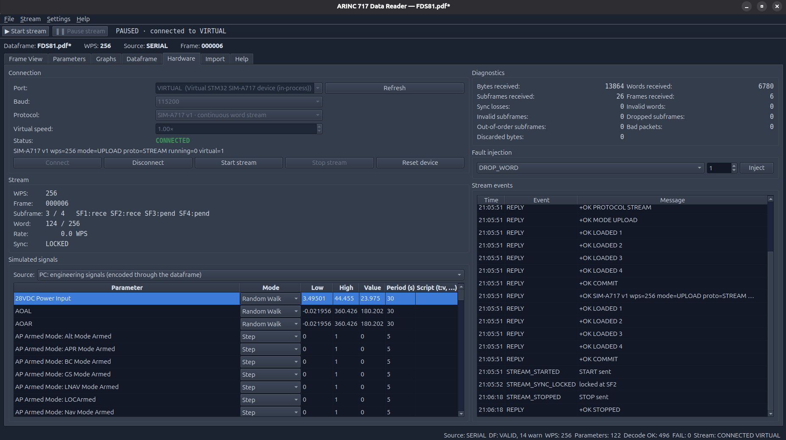

# 02 — Installation and running

## Requirements

| Component | Version | Role |
| --- | --- | --- |
| Python | 3.12 or newer | runtime |
| PySide6 | 6.5 or newer | desktop GUI |
| PyMuPDF (`pymupdf`) | 1.24 or newer | PDF reading, rendering and native table detection |
| numpy | 1.26 or newer | grid detection on scanned pages |
| pyserial | 3.5 or newer | COM port access for the hardware-in-the-loop stream (port listing, 8N1 transport) |
| rapidocr-onnxruntime | 1.3 or newer, optional | OCR for scanned pages without a text layer |
| pytest | 7.4 or newer, development only | test suite |
| arm-none-eabi-gcc, openocd or stm32flash | optional | Building and flashing the STM32 stream emulator firmware; not needed to run the application |

The application runs on Linux, and the GUI works both on a normal display and
headless with `QT_QPA_PLATFORM=offscreen` (used by the tests). No system
packages beyond Python are required; the OCR engine ships its models inside
the Python package, so no Tesseract installation is needed. No hardware is
required either: the Hardware page offers a `VIRTUAL` port that runs the
STM32 emulation in-process.

## Setting up

From the project directory:

```bash
python3 -m venv .venv
.venv/bin/pip install -e ".[dev]"
```

The `dev` extra installs pytest and the OCR engine. Use `.[ocr]` for the OCR
engine alone, or plain `.` for a GUI without OCR support: the PDF importer
then still handles born-digital PDFs and scanned pages that carry a text
layer, and reports scanned pages that would need OCR instead of reading them.

The editable install also creates the `arinc717-reader` launcher inside the
virtual environment.

## Starting the application

```bash
.venv/bin/arinc717-reader                            # start with no dataframe
.venv/bin/arinc717-reader examples/demo_256wps.adb   # start with the demo dataframe loaded
.venv/bin/python -m arinc717_reader                  # same, without the launcher
```

The single optional command-line argument is a path to an `.adb` file to load
at startup. A file that fails to parse is logged as an error and the
application still opens.

Logging goes to standard error in the form
`timestamp module level message`, with structured `event=... key=value` text
for the important operations (dataframe loaded, frame saved, PDF imported,
PDF published, serial connected, stream started, fault injected, recording
started, replay started). Per-word and per-sample
activity is never logged at INFO (spec v2 §48); sync losses and rate
mismatches are warnings.

### Trying the live stream without hardware



*The Hardware page connected to the in-process virtual device: the event log shows the handshake replies, the table lists the simulated signals.*


1. Load a dataframe (the demo is fine).
2. Press **▶ Start stream** in the toolbar: it connects to the port selected
   on the **Hardware** tab (`VIRTUAL` by default) and starts the stream.
3. Watch the **Frame View** update one subframe column per second, then open
   the **Graphs** tab and choose a parameter. **❚❚ Pause stream** holds the
   frame; the **Help** tab (F1) explains every page.

The *Virtual speed* factor on the Hardware page runs the virtual device
faster than real time; it does nothing for a real port. With a real STM32
board, pick its FTDI port instead of `VIRTUAL`; building and wiring the board
is described in the [firmware README](../firmware/stm32f103_sim_a717/README.md)
and the protocol in [12 — The SIM-A717 v1 protocol](12-sim-a717-protocol.md).

## Bundled examples

| File | Content |
| --- | --- |
| `examples/demo_256wps.adb` | The demo dataframe (256 WPS, 12 parameters covering every parameter type) in `.adb` form. Regenerate with `.venv/bin/python examples/make_demo_adb.py`. |
| `examples/demo_256wps.pdf` | The same dataframe rendered as a born-digital dataframe document, for trying the PDF importer. Regenerate with `.venv/bin/python examples/make_demo_pdf.py`. |
| `examples/Scanned_from_UK_Lexmark03-12-2025-123425 (1) data frame.pdf` | A real scanned CN235-220 dataframe layout document (21 pages). See [07 — PDF import](07-pdf-import.md#the-cn235-220-document). |

The Import page also has a **Load Demo Dataframe** button that loads the demo
dataframe directly from code, without any file.

## Running the tests

```bash
.venv/bin/python -m pytest
```

The suite takes about half a minute. It includes offscreen GUI smoke tests
that run in a subprocess, synthetic PDF documents generated on the fly
(born-digital, scanned with a text layer, scanned image-only with OCR), a
fast test against the text-layer pages of the real CN235 document, and the
live-stream tests, which drive the virtual STM32 device at 200× speed through
the real acquisition, decoding, graphing and recording path. The full OCR run
over the CN235 document takes a few minutes and is skipped unless you ask for
it:

```bash
ARINC717_OCR_TESTS=1 .venv/bin/python -m pytest tests/test_real_document.py
```

### A note on this machine

The development machine sources ROS Jazzy in its shell profile, which puts
broken pytest plugins on the path. `pyproject.toml` disables them in
`addopts`; keep that block when changing the pytest configuration.

## Headless use

Every non-GUI component can be driven from Python without a window:

```python
from arinc717_reader.app import build_context

ctx = build_context()
ctx.dataframe_service.load_adb("examples/demo_256wps.adb")
ctx.frame_service.new_blank(with_sync_words=True)
ctx.frame_service.set_word(1, 4, 3412)
for value in ctx.engineering_store.values:
    if value.parameter_name == "PITCH ATT #1" and value.subframe == 1:
        print(value.engineering_value)     # -30.096
```

`build_context()` wires the stores and services exactly as the GUI does; the
decoding service re-decodes automatically whenever the frame or the dataframe
changes.

The live path works headless too; without the GUI's 50 ms timer, call
`ctx.pump()` yourself to move stream events onto the stores:

```python
import time
from arinc717_reader.app import build_context

ctx = build_context()
ctx.dataframe_service.load_adb("examples/demo_256wps.adb")
ctx.serial_service.connect("VIRTUAL", virtual_speed=50.0)   # or "/dev/ttyUSB0"
ctx.serial_service.start_stream()
while ctx.stream_store.diagnostics.frames_received < 3:
    ctx.pump()
    time.sleep(0.01)
print(ctx.timeseries_store.stats("demo-ias"))               # count, current, min, max, average
ctx.shutdown()
```

## Standalone executable

On Windows the folder build can also be wrapped into a single `.msi`
installer (`packaging\build_msi.bat`, WiX Toolset): Start Menu and desktop
shortcuts, an entry in Settings > Apps, in-place upgrades. See
[packaging/README.md](../packaging/README.md#msi-installer-one-file-click-to-install).

A one-folder build with an `.exe` for Windows (or a binary for Linux) can be
made with PyInstaller; the spec, the build scripts and the troubleshooting
notes are in [`packaging/README.md`](../packaging/README.md). The build must
be made on the target operating system. `ARINC717Reader --selftest` checks a
finished build without opening a window: decoder loop, ADB round trip, a
virtual HIL stream (connect, two frames, sync locked, samples decoded), GUI
construction, PDF import and, optionally, the OCR engine.

