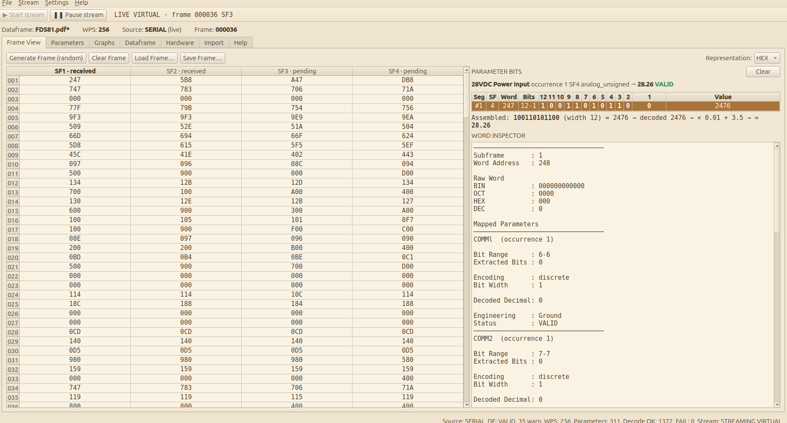
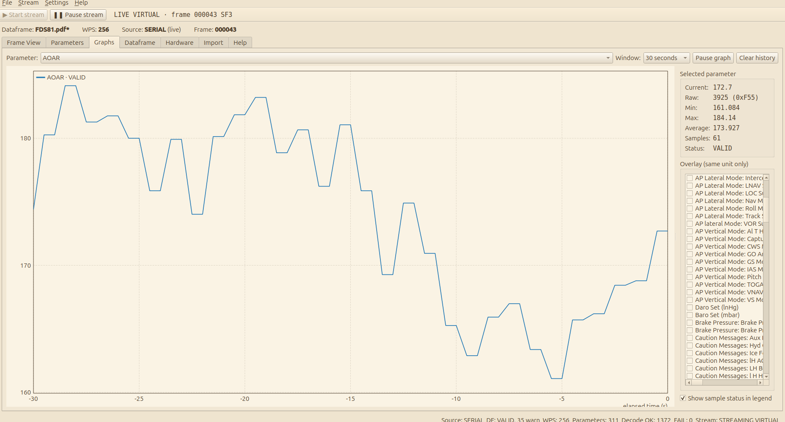
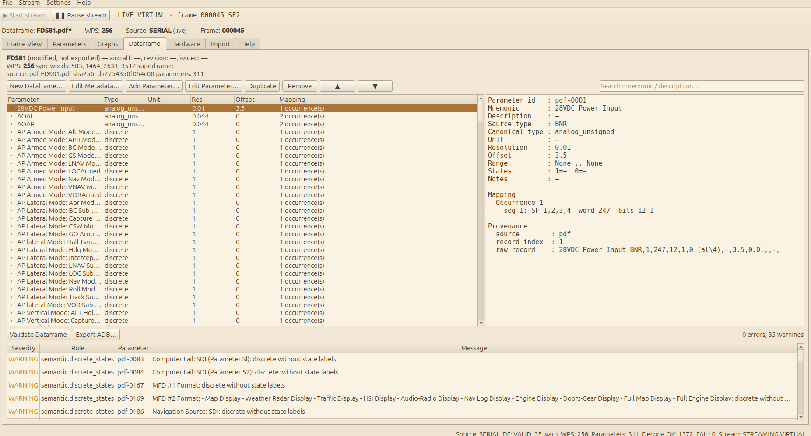
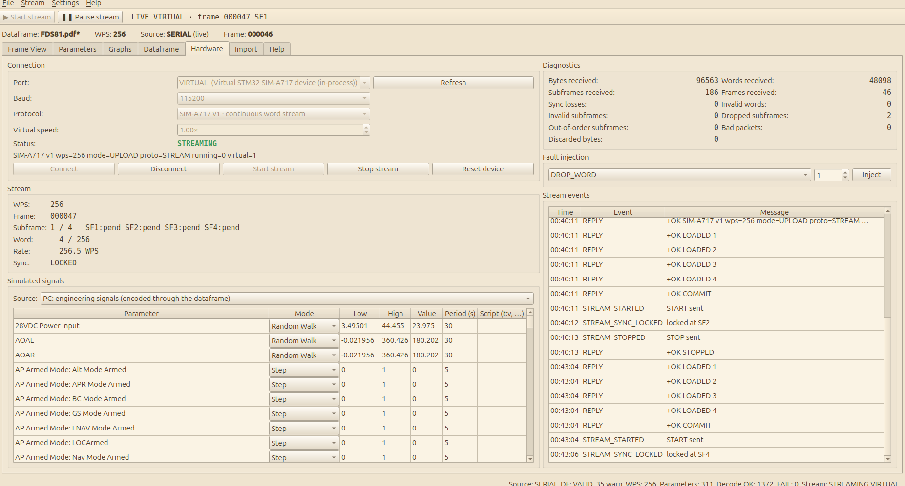
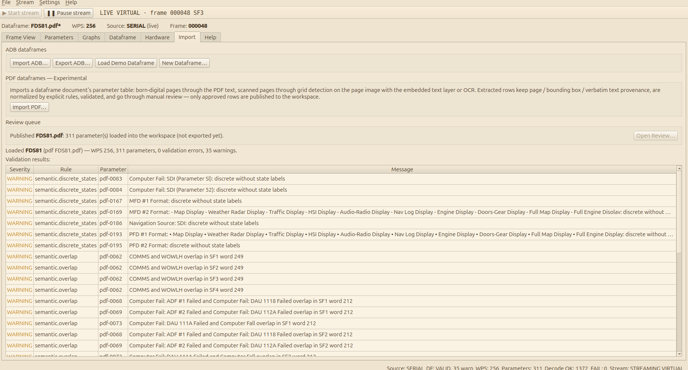
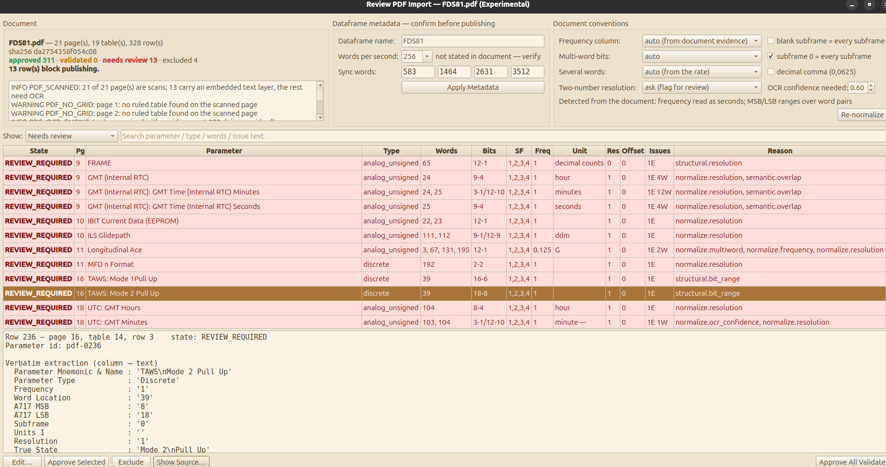

# 03 — User guide

## The main window



*The main window: menu bar, the stream toolbar with the stream state, the header line, the tabs, the Frame View with the Parameter Bits panel and the Word Inspector, and the status bar.*


```
┌──────────────────────────────────────────────────────────────────────────────────┐
│ File   Stream   Help                                                             │
│ ▶ Start stream  ❚❚ Pause stream   LIVE VIRTUAL · frame 000031 SF3                  │
│ Dataframe: demo_256wps.adb*   WPS: 256   Source: SERIAL (live)   Frame: 000031    │
├──────────────────────────────────────────────────────────────────────────────────┤
│ [Frame View] [Parameters] [Graphs] [Dataframe] [Hardware] [Import] [Help]         │
│                                                                                  │
│                                current page                                      │
│                                                                                  │
├──────────────────────────────────────────────────────────────────────────────────┤
│ Source: SERIAL  DF: VALID, 1 warn  WPS: 256  Parameters: 12  Decode OK: 39  FAIL: 1  Stream: STREAMING VIRTUAL  ● REC │
└──────────────────────────────────────────────────────────────────────────────────┘
```

**Header line.** The loaded dataframe (its file name, or its name when it was
not loaded from a file), its WPS, the name of the source that produced the
current frame (`RAW RANDOM`, `MANUAL`, `FILE name.json`, and `SERIAL` or
`REPLAY` with the suffix `(live)` while a frame is still being received), and
the frame index. A `*` after the dataframe name means it has
edits or imported content that has not been exported yet; the window title
shows the same marker.

**Stream toolbar.** Two buttons that control the incoming stream from any
page, and a state text.

| Button | Effect |
| --- | --- |
| ▶ Start stream | Starts the live stream. When nothing is connected it first connects with the port, baud and protocol chosen on the Hardware page (the virtual device by default), then starts. During a paused replay it resumes the replay. Starting after a pause restarts the frame counter at 0. |
| ❚❚ Pause stream | Sends `STOP` to the device: the incoming stream stops and the last frame stays in the Frame View as a static frame that can be inspected, edited and saved; ▶ Start stream resumes. During a replay it pauses the replay. Recording is not affected (it simply records nothing while the stream is paused). |

The state text reads `LIVE VIRTUAL · frame 000031 SF3` while streaming,
`PAUSED · connected to VIRTUAL` while connected but stopped, `REPLAY 3.2 /
12.0 s` (or `REPLAY paused …`) during a replay, `RECONNECTING` while the
link is being recovered, and a hint when nothing is connected. Recording and
replay are started from the File menu, see
[Recording and replay](#recording-and-replay).

**Status bar.** The frame source, the dataframe validity (`VALID`, or the
number of validation errors, plus the number of warnings), the WPS of the
*frame* (which can differ from the dataframe's WPS until a new frame is
generated), the parameter count, how many decoded samples are `VALID` versus
any other status, the stream state with its port (`Stream: STREAMING
/dev/ttyUSB0`, `Stream: RECONNECTING VIRTUAL`, `Stream: —` when nothing is
connected), and `● REC` or `▶ REPLAY` while a recording or a replay runs.

**File menu.** New Dataframe…, Open ADB…, Import PDF…, Export ADB…, Load
Frame…, Save Frame…, then the session entries Record Session…, Stop
Recording, Replay Session…, Pause Replay (checkable), Stop Replay and the
Replay Speed submenu (0.25×, 0.5×, 1×, 2×, 5×, 10×), and Quit.

**Stream menu.** Connect and Disconnect (the Hardware page buttons, using
its current port and settings), Start Stream and Pause Stream (the toolbar
buttons).

**Settings menu.** Theme → System default, the light themes (Light, Solarized
Light, Sepia) and the dark themes (Dark, Solarized Dark, Nord, Midnight Blue,
Cockpit, High Contrast). Named themes use the Fusion style with their own
palette on every platform; System default keeps the colours the operating
system gave the application. The
choice applies immediately to every page and is remembered for the next
start (QSettings: the registry on Windows, `~/.config/arinc717_reader/` on
Linux).

**Help menu.** User Guide (F1) opens the [Help](#help) tab; About shows the
version.

## Frame View


*A frame under reception: word addresses down the side, SF1–SF4 across (SF1 and SF2 received, SF3 and SF4 pending), HEX representation; the Parameter Bits panel and the Word Inspector on the right.*


The Frame View shows the canonical frame as a table with one row per word
address (001 to WPS) and one column per subframe (SF1 to SF4). Cells are
centred, monospaced, and formatted in the selected representation.

**Controls.**

| Control | Effect |
| --- | --- |
| Generate Frame (random) | Replaces the frame with uniform random words (0 to 4095). Labelled RAW RANDOM because engineering values are meaningless. |
| Clear Frame | Replaces the frame with all zeros, without sync words. |
| Load Frame… / Save Frame… | Frame JSON files, see [08 — File formats](08-file-formats-and-storage.md#frame-files). Loading refuses a file whose WPS differs from the loaded dataframe. |
| Representation | BIN (12 zero-padded bits), OCT (4 digits), DEC, HEX (3 digits). Switching never changes the data. |

The frame's WPS follows the loaded dataframe; with no dataframe it is 256.

**Single click** on a cell opens it in the **Word Inspector** on the right;
from there the **arrow keys** move the selection and the inspector follows.
The selected cell is drawn in the selection colour and the rest of its row is
tinted, so the same word address can be compared across SF1 to SF4 at a
glance. **Double click** opens the **edit dialog**. The selected cell is kept
when a new frame replaces the current one, as long as the address still
exists.

### Word Inspector

The inspector is a diagnostic panel that exposes the full decoding chain of
the selected word. It shows the raw word in all four representations and then,
for every parameter mapped to that word in that subframe, a block like:

```
PITCH ATT #1  (occurrence 1)

Bit Range      : 12-3
Extracted Bits : 1101010101

Encoding       : analog_signed
Bit Width      : 10

Decoded Decimal: -171
Resolution     : 0.176
Offset         : 0

Engineering    : -30.096 deg
Status         : VALID
```

If several parameters share the word, every one is listed. For multi-segment
parameters the *extracted bits* line shows only this word's segment; the
*decoded decimal* and *engineering* lines refer to the whole assembled value.
The panel updates whenever the frame or the decoded values change.

### Parameter Bits panel

Above the Word Inspector sits the **Parameter Bits** panel. It shows the raw
words behind one decoded sample chosen on the Parameters page (select the
row and press **Show in Frame View**, or double-click it):

- a summary line with the parameter, occurrence, subframe, type, engineering
  value and status;
- one row per **segment**, in assembly order (first row = most significant
  bits): subframe, word address, bit range, the twelve bits of the word with
  the segment's bits highlighted and the rest dimmed, and the extracted bits
  with their value. A parameter built from several words, such as a
  coarse/fine altitude or a word pair, shows all of its words stacked;
- the assembled bits, decoded decimal, conversion and engineering value.

The words are outlined in the frame table and the first one is selected, so
the Word Inspector shows it; clicking a segment row selects that word
instead. The panel follows the frame, so during a stream the bits change as
the sample's subframe arrives. **Clear** stops following the sample.

### Editing a word

The edit dialog shows the subframe, the word address, the current value in
all representations, a representation selector and an input field. Enter the
new value in the chosen representation and press OK. Anything that is not a
valid number in that base, or that exceeds 12 bits (4095), is rejected with a
message and the dialog stays open. A successful edit changes exactly that
canonical cell and immediately re-decodes every parameter that uses it.

### Live streaming

While a stream is being received, or a session is being replayed, the
Frame View updates one subframe column per second (spec v2 §26T). The
column of the subframe that just arrived is refreshed; the other columns
keep showing the **value each word had before**, so every cell always shows
its last known value and the table never blanks out between frames. The
header reads `Source: SERIAL (live)`, and each column header carries the
state of its subframe slot in the current frame, `SF1 · received`,
`SF3 · pending`:

| Slot state | Shown as | Meaning |
| --- | --- | --- |
| `RECEIVED` | current values, normal cells | The subframe arrived in order with a valid sync word. |
| `PENDING` | previous frame's values, normal cells | Not received yet in this frame. `----` appears only for a subframe that has never held any data (the first frame after connecting). |
| `MISSING` | previous frame's values on orange | A later subframe arrived without it, or the next frame began. |
| `INVALID` | received words on red | The sync word, the length or a word value was wrong; a single out-of-range word is tinted a stronger red. |
| `LATE` | current values on blue | Arrived out of order after having been marked missing. |

Hovering a cell names its slot state (and says when it shows the previous
frame's words). The frame index advances every four subframes. Editing a
word is refused while the frame is live (`INVALID_WORD: the frame is being
received live; stop the stream to edit`): press ❚❚ Pause stream first. The
Parameters page shows the value decoded from each subframe as it arrives
rather than a whole-frame decode. Pausing the stream, or losing the
connection, leaves the last frame in place as an ordinary static frame, every
subframe holding its last known words, that can be inspected, edited and
saved.

## Parameters


*One row per decoded sample of the current frame, refreshed in place during a stream; selecting a row shows its full decode trace underneath, and Show in Frame View opens its words in the Frame View.*


The Parameters page lists every decoded **sample**: one row per parameter,
occurrence and subframe. A parameter recorded in all four subframes with two
occurrences therefore appears eight times.

| Column | Meaning |
| --- | --- |
| Mnemonic, Description, Type | From the dataframe. Type is the canonical type (`analog_signed`, `analog_unsigned`, `bcd`, `discrete`, `raw`, `unknown`). |
| Occ, SF | Occurrence index and the subframe this sample came from. |
| Raw | The assembled raw bits of all segments, most significant first. |
| Decimal | The decoded decimal: two's-complement value for signed parameters, the integer for unsigned, the digit value for BCD (the weighted sum of the digits when the dataframe gives one weight per word part), the field value for discretes. |
| Resolution, Offset | The linear conversion; shown only for analog and BCD types. |
| Engineering | The converted value, or the state label for discretes (from the parameter's state table, else its `1 =` / `0 =` labels). |
| Unit | From the dataframe. |
| Source | Where the parameter definition came from (`adb`, `pdf`, `demo`, `manual`, `repository`). |
| Status | `VALID`, or a diagnostic status; non-valid statuses are coloured. |

Filters: free-text search over mnemonic and description, and drop-downs for
type, status and subframe. Selecting a row shows its complete **decode
trace** below the table: every segment with its subframe, word, bit range,
the word value and the extracted bits, then the assembled bits, decoded
decimal, resolution, offset and engineering value. See
[05 — Decoding](05-decoding-and-encoding.md) for the meaning of each status.
**Show in Frame View** (or a double-click on the row) switches to the Frame
View with the sample's words in the [Parameter Bits panel](#parameter-bits-panel).

During a live stream or a replay the table holds the latest value of every
(parameter, occurrence, subframe) sample and changes subframe by subframe.
The values change in place: the selected row, its decode trace and the scroll
position stay put while the stream runs, so a row can be followed with the
arrow keys. When the set of rows itself changes (another dataframe, a
parameter added or removed) the same sample is selected again.

Column widths are fixed: drag a header edge to change one, and Description
takes the remaining width. They are never re-fitted to the values, so the
layout does not move during a stream.

## Graphs



*A 30-second window of the AOAR parameter with the statistics box and the overlay list of parameters that share its unit.*


The Graphs page plots the history of decoded samples that the live stream
(or a replay) produces (spec v2 §26O, §46A). It reads the bounded
time-series store and never decodes anything itself; with no stream running
it shows the history that is still buffered, or "no samples yet".

```
┌──────────────────────────────────────────────────────────────────────────┐
│ Parameter: [IAS [kt] ▼]  Window: [30 seconds ▼]  [Pause graph] [Clear history] │
├──────────────────────────────────────────────┬───────────────────────────┤
│ kt                                           │ Selected parameter        │
│ 180 |                        ╭──             │  Current: 167.25 kt       │
│ 160 |           ╭────────────╯               │  Raw:     669 (0x29D)     │
│ 140 |──────╮╭───╯                            │  Min:     145             │
│     +---------------------------- elapsed (s)│  Max:     171.25          │
│    -30      -20       -10        0           │  Average: 158.9           │
│                                              │  Samples: 30              │
│                                              │  Status:  VALID           │
│                                              ├───────────────────────────┤
│                                              │ Overlay (same unit only)  │
│                                              │  ☐ IAS #2   ☑ GROUND SPD  │
└──────────────────────────────────────────────┴───────────────────────────┘
```

| Control | Effect |
| --- | --- |
| Parameter | Every dataframe parameter with a known type, labelled `mnemonic [unit]`, plus any series the store still holds from another dataframe. Discretes plot as 0/1. |
| Window | 10 seconds, 30 seconds, 1 minute, 5 minutes, 10 minutes, All buffered. The x axis counts seconds back from the newest sample. |
| Pause graph / Resume graph | Freezes the view at the current end time. Acquisition, decoding and recording continue (the legend says so); resuming shows what happened meanwhile. |
| Clear history | Empties the time-series store for every parameter. |
| Overlay | Check boxes for the parameters that share the selected parameter's unit; each checked one is drawn in its own colour with a legend. Parameters with another unit are not offered, so one y axis never mixes units (spec v2 §26P). |
| Show sample status in legend | Adds the latest sample's decode status to each legend entry (`IAS · VALID`) and keeps the legend visible even for a single series, so a parameter that stopped decoding cleanly is visible on the plot itself, not only in the Status row. |

The **Selected parameter** box shows the latest sample's engineering value
with its unit, its raw value (decimal and hex), the minimum, maximum and
average over the visible window, the number of samples in that window, and
the latest sample's decode status. A parameter whose latest sample has a
non-numeric status (for example `INVALID_MAPPING`) shows that status and
adds no point.

The y axis auto-ranges over the visible samples with 5 % headroom; the plot
redraws at most ten times a second and only when new samples arrived. The
history is bounded to 10,000 samples or 10 minutes per parameter, whichever
is reached first (spec v2 §26N).

## Dataframe



*Metadata line, the 311 imported parameters, the details pane with mapping and provenance, and the validation issues of the loaded dataframe (35 warnings from the scanned document).*


The Dataframe page is where a dataframe is browsed, inspected and edited.

**Metadata line.** Name, aircraft type, revision, issue date, WPS, sync
words, superframe flag, source type and file, the first characters of the
source file's SHA-256, and the parameter count. "(modified, not exported)"
appears while there are unexported edits.

**Toolbar.**

| Button | Effect |
| --- | --- |
| New Dataframe… | Creates an empty dataframe from a metadata dialog (name, aircraft, revision, date, WPS, superframe flag, four sync words). Asks first if the current dataframe has unexported edits. |
| Edit Metadata… | The same dialog for the loaded dataframe. Changing the WPS re-validates all mappings but does not rebuild the current frame. |
| Add Parameter… / Edit Parameter… | The parameter editor, described below. Double-clicking a parameter also opens it. |
| Duplicate | Copies the selected parameter with the mnemonic suffixed " COPY" and a fresh id; provenance is dropped because the copy was made in the application. |
| Remove | Deletes the selected parameter after confirmation. |
| ▲ ▼ | Move the parameter up or down. Parameter order is the export order. |
| Search | Filters the tree by mnemonic, description, unit or type. |

**Tree.** One top-level row per parameter (mnemonic, type, unit, resolution,
offset, occurrence count), expandable into occurrences and segments
(`SF 1,2,3,4  word 004  bits 12-3`).

**Details panel.** For the selected parameter: identity, source and canonical
type, unit, conversion, range, decimals (`auto` when derived from the
resolution), the discrete states (the `1 =` / `0 =` labels and, for a
multi-state discrete, the whole table), notes, the full mapping with any BCD
digit weight and preserved legacy flag per segment, and the **provenance**:
the source type, the record index and the verbatim source record for `.adb`
imports, trailing unknown fields, any *import note* (what the ADB parser had
to guess or ignore, such as a subframe selector it did not use), and for PDF
imports the page, table, row and raw cells. Below that, the preserved
unknown settings fields of an `.adb` header are listed.

**Validate Dataframe** re-runs validation; the issues table lists every issue
with its severity, rule name, parameter and message. **Export ADB…** writes
the dataframe in the AFDA layout ([06](06-adb-format.md)) and clears the
modified marker: a parameter that is unchanged since its import is written
back exactly as it was read, everything else is generated from its
definition. Notes have no column in that format and are not exported.

### The parameter editor

The editor dialog has three parts.

1. **Definition form.** Mnemonic (required), description, source type,
   unit, resolution and offset, minimum and maximum, decimals (blank means
   "auto": derived from the resolution), the discrete state labels ("1 ="
   and "0 ="), and notes. A discrete imported with a multi-state table keeps
   the table across an edit; the two labels update its rows 1 and 0. The
   **source type** is an editable
   combo box (Signed Analog, Unsigned Analog, BNR, BCD, Discrete, Raw, or any
   text); the canonical type shown next to it is *derived* from that text by
   the same normalisation every importer uses, so it can never disagree with
   an import. Unrecognised text yields `unknown` and a warning.
2. **Mapping table.** One row per segment: occurrence index, segment
   sequence, subframes, word, LSB, MSB. Subframes accept `1,3`, `2-4`, `all`,
   or ADB selector digits such as `13`. Segment sequence 1 holds the most
   significant bits of a multi-segment value. **Add Segment** adds a segment
   to the current occurrence, **Add Occurrence** starts a new occurrence,
   **Remove Row** deletes a row. Nothing is renumbered silently; duplicate
   indexes are reported by the validator.
3. **Check** previews the validation issues the edit would cause, including
   overlaps with other parameters, without committing. **OK** commits through
   the dataframe service even if issues remain (the domain is permissive; the
   issues stay visible on the page). Invalid *input*, such as a non-numeric
   word, keeps the dialog open with a message.

Every committed edit re-decodes the current frame immediately. An edited
parameter keeps its provenance and its state table; on export it is
regenerated in the AFDA layout, while the untouched parameters of an `.adb`
import are still written back verbatim. One caveat: the editor rebuilds the
mapping rows without BCD digit weights, so a BCD parameter imported with
one weight per word part decodes as plain nibble BCD after it has been
edited in this dialog (and is exported without weights); reload the file to
get the weights back.

## Hardware



*Connected to the virtual device and streaming: the connection settings are locked while connected; stream progress, simulated signals, diagnostics, fault injection and the event log with the handshake replies.*


The Hardware page connects the application to the STM32 stream emulator, or
to its in-process twin, and shows what the stream is doing (spec v2 §26S,
§46B). Every action goes through the serial service; the page only renders
the stream state. A dataframe must be loaded first: its WPS and sync words
are sent to the device.

**Connection.**

| Control | Meaning |
| --- | --- |
| Port | `VIRTUAL` (the in-process device) followed by every serial port pyserial can see (`/dev/ttyUSB0`, `COM7`, with its description). **Refresh** rescans; a port name can also be typed. |
| Baud | 9600 to 921600; the link is always 8 data bits, no parity, one stop bit. The firmware runs at 115200. |
| Protocol | `SIM-A717 v1 · continuous word stream` (normal) or `SIM-A717 v1 · framed packets (diagnostics)`. See [12](12-sim-a717-protocol.md). |
| Virtual speed | Time factor for the virtual device only (1× is real time). |
| Status | `DISCONNECTED`, `CONNECTING`, `CONNECTED`, `STREAMING`, `RECONNECTING`, `REPLAYING`, coloured; after a failure the reason follows the state. The device's `INFO` line appears below while connected. |
| Connect | Opens the port and runs the handshake: `STOP`, `PING`, then WPS, sync words, protocol and signal source are configured. Fails with `SERIAL_PORT_ERROR` when the port cannot be opened or nothing answers, `INVALID_SIM_PROTOCOL` when the answer is not a SIM-A717 device. |
| Disconnect | Stops the stream if needed and closes the port. |
| Start stream / Stop stream | `START` / `STOP` on the device; the toolbar's ▶ Start stream and ❚❚ Pause stream are the same actions. Stopping leaves the last frame in the Frame View as a static frame. |
| Reset device | Stops the stream, sends `RESET`, re-sends the configuration and clears the diagnostics. |

Port, baud, protocol and speed can only be changed while disconnected. If
the port disappears while connected (cable pulled, board reset), the status
turns `RECONNECTING`, the service retries every half second, and the stream
restarts by itself once the device answers again; **Disconnect** gives up.

**Stream.** WPS; the frame index being assembled; the subframe being
received (`2 / 4`) followed by the state of all four slots
(`SF1:rece SF2:pend …`); the words received so far in that subframe
(`162 / 256`); the measured rate in words per second over the last two
seconds (or the replay position while replaying); and the synchronizer
state, `SEARCHING` or `LOCKED`, with a hint such as "sync spacing looks like
128 WPS" when the sync words repeat at another rate than the dataframe
declares.

**Simulated signals.** The *Source* selector decides what the device
streams:

| Source | Behaviour |
| --- | --- |
| PC: engineering signals (encoded through the dataframe) | Default. The PC generates an engineering value per parameter and subframe, encodes it with the normal parameter encoder and uploads one frame ahead to the device, so the decoded stream is coherent with the dataframe (spec v2 §26H "Engineering Random"). |
| Device: raw random walk | The device itself steps every word by −8..+8 per emission. Engineering values are meaningless; for parser and Frame View testing. |
| Device: raw random | Uniform random words (spec v2 §26H "Raw Random"). |
| Device: fixed frame | The device repeats its current frame buffer. |

The table below the selector is active for the PC source and has one row per
encodable parameter (a known type with a mapping and, for analog and BCD
types, a non-zero resolution):

| Column | Meaning |
| --- | --- |
| Mode | Fixed, Uniform Random, Random Walk (default), Sine, Ramp, Step, Scripted. |
| Low, High | Bounds for every mode. Defaults come from the parameter's declared range, clipped to what its mapping can actually encode. |
| Value | The Fixed value; the starting point of a Random Walk or a Step. |
| Period (s) | Sine period, Ramp duration, Step interval, in seconds of simulated time. |
| Script (t:v, …) | Points for the Scripted mode as `time:value` pairs, for example `0:100, 40:300, 80:100`; values between points are interpolated linearly and held beyond the ends. A malformed script turns the cell red with the error as its tooltip and keeps the previous points. |

Edits apply at once; the next uploaded frame uses them. Discretes default to
a Step between their two states every 5 s. A value outside what the mapping
can encode is reported once in the event log as `ENCODE_ERROR`; adjust Low
and High.

**Diagnostics.** Bytes, words, subframes and frames received; sync losses;
invalid words (mis-aligned or corrupted containers); invalid subframes;
dropped subframes (slots marked missing); out-of-order subframes; bad
packets (framed mode); discarded bytes. **Reset device** clears them.

**Fault injection** (spec v2 §26J). Choose a fault, a count (1 by default;
0 disarms, 65535 means continuous) and press **Inject**. The faults and
their visible effects are listed in [12](12-sim-a717-protocol.md#faults-fault);
`DISCONNECT_RECONNECT` exists only on the virtual device and is the way to
watch the automatic reconnection.

**Stream events.** The last 200 events with time, kind and message:
connection changes, replies during the handshake, `STREAM_STARTED`,
`STREAM_SYNC_LOCKED`, `STREAM_SYNC_LOST`, `STREAM_RATE_MISMATCH`,
`SUBFRAME_INCOMPLETE`, `FRAME_INCOMPLETE`, `FAULT_INJECTED`,
`SERIAL_DISCONNECTED`, `RECONNECTED`, `REPLAY_STARTED`, `REPLAY_FINISHED`,
`ENCODE_ERROR`. Losses, errors and disconnections are red, incomplete data,
mismatches and injected faults orange.

## Recording and replay

Recording and replay (spec v2 §26R, §46C) are in the File menu and work on
whatever stream is running, live or replayed.

| Entry | Availability | Effect |
| --- | --- | --- |
| Record Session… | A device is connected (or a replay runs) and nothing is being recorded or replayed | Asks for a file name (`.a717session` is appended) and records every received subframe, every decoded sample and every stream event from that moment on. |
| Stop Recording | While recording | Closes the file; the status bar shows `Recorded name.a717session` for a few seconds. |
| Replay Session… | Nothing is being recorded or replayed | Asks for a session file and replays it at the speed chosen in **Replay Speed** (0.25× to 10×, set before starting). A connected device is disconnected first; the replay takes the place of the live source. |
| Pause Replay / Stop Replay | While replaying | Hold the replay in place (the toolbar's ❚❚ Pause stream does the same, and ▶ Start stream resumes), or end it. |

While recording, the status bar shows `● REC`. While replaying it shows
`▶ REPLAY`, the toolbar shows the position (`REPLAY 3.2 / 12.0 s`), the
header reads `Source: REPLAY (live)` and the Hardware page `REPLAYING`; the
Frame View, Parameters and Graphs pages behave exactly as during a live
stream because the recorded subframes go through the same decoder. When the
file ends the source detaches and the stream state returns to `—`.

A session remembers the dataframe name, WPS, sync words, source, port, baud,
protocol and simulator settings. Replay refuses a file whose WPS differs
from the loaded dataframe (`REPLAY_ERROR`) and logs a warning when the
dataframe name differs; a file cut short by a crash replays up to its last
complete record. The format is described in
[08 — File formats](08-file-formats-and-storage.md#session-files) and
[13](13-live-streaming-graphs-recording.md#recording).

## Import



*After publishing a PDF import: the review queue reports what was loaded (311 parameters from FDS81.pdf) and the validation results list the warnings.*


**ADB dataframes.** Import ADB…, Export ADB…, Load Demo Dataframe, New
Dataframe…. Import errors are shown in a message box with the parser's
record-level explanation; a file written in this project's earlier
provisional layout is refused with `expected 238 (AFDA layout)` and has to
be recreated (see [10 — Troubleshooting](10-troubleshooting.md#adb-files)).

**PDF dataframes (Experimental).** Import PDF… runs the pipeline of
[07 — PDF import](07-pdf-import.md) in the background with a progress dialog
and opens the review dialog when it finishes. The button is disabled with an
explanatory tooltip when PyMuPDF is not installed.

**Review queue.** Shows the state of an import that has not been published
yet ("12 rows — 11 approved, 1 need review, 0 excluded. 1 row(s) block
publishing.") and reopens its review dialog with **Open Review…**. After
publishing, the line reports what was loaded.

**Validation results.** The current dataframe's summary and issues.

## Help


The last tab is the in-application user guide: a section list on the left
(Overview, Getting started, the main window and menus, one section per page
and dialog, recording and replay, connecting the STM32 board, the messages
the application can show, a glossary), the guide itself on the right, and a
search box above (**Find next** jumps to the next match and wraps around).
Help → User Guide or **F1** opens it from anywhere; links inside the guide
jump between sections.

## Step-by-step workflows

### Inspect a dataframe and a frame

1. File → Open ADB… and choose the file (or Import page → Load Demo
   Dataframe).
2. Dataframe tab: expand a parameter to see its mapping; read the details
   panel for the source record.
3. Frame View tab → Clear Frame (all words zero).
4. Double-click SF1 word 004, enter `D54` (HEX), OK. The inspector shows
   `PITCH ATT #1` decoding to −30.096 deg.
5. Parameters tab: filter Status = `VALID`, select the pitch row, read the
   trace.
6. Frame View → Save Frame… to keep the frame as JSON.

### Author a dataframe by hand

1. File → New Dataframe…; set the name, WPS and sync words.
2. Dataframe tab → Add Parameter…; fill the definition, add mapping rows,
   press Check, then OK.
3. Repeat; use Duplicate for similar parameters.
4. Export ADB… when done. The `*` marker disappears.

### Check a mapping with a known word

1. Load the dataframe, Frame View → Clear Frame.
2. Take a word whose meaning you know from the dataframe document (a
   published test pattern, or a value you encode by hand from resolution and
   offset) and enter it with a double-click on that cell.
3. Read the Word Inspector: the extracted bits, the decoded decimal and the
   engineering value must match your expectation. A wrong value points at the
   bit range, the sign convention, the resolution or offset, or the segment
   order of the parameter; fix it on the Dataframe page and the inspector
   re-decodes at once.

The live stream is a continuous version of the same check: with the default
"PC: engineering signals" source the values are encoded through the
dataframe and decoded back, so a parameter whose mapping is wrong shows
implausible values or a non-`VALID` status on the Parameters page.

### Import a dataframe document (PDF)



*The review dialog filtered to "Needs review": 311 of 328 rows were approved automatically; the 13 shown carry an error each (an unreadable resolution, a bit number outside 1–12) and must be edited or excluded before publishing.*


1. File → Import PDF…, choose the document, wait for the progress dialog.
2. In the review dialog confirm WPS and sync words (Apply Metadata), then
   declare any conventions the importer flagged (Re-normalize).
3. Filter "Needs review", work through rows with Show Source…, Edit…, Approve
   Selected or Exclude. Ctrl+A or a Shift+click range selects only the rows
   the filter shows; the buttons say how many rows they will act on.
4. Publish to Workspace. The dataframe is now loaded and marked unexported;
   Export ADB… writes it.

The review dialog is described in detail in
[07 — PDF import](07-pdf-import.md#the-review-dialog).

### Stream from the virtual device and graph a parameter

1. Load a dataframe (Import → Load Demo Dataframe).
2. Press **▶ Start stream** in the toolbar. Nothing being connected yet, it
   connects to the port selected on the Hardware page (`VIRTUAL` by default,
   *Source* "PC: engineering signals") and starts the stream; the Hardware
   page shows `STREAMING`, the device's `INFO` line and the handshake
   replies in the event log. (Hardware → **Connect**, then **Start stream**
   does the same in two steps.)
3. The Frame View updates one subframe column per second with `SF1 ·
   received`, `SF2 · pending` headers, the other columns keeping their last
   words; the Stream box counts words and frames; the Parameters page
   updates subframe by subframe.
4. Graphs tab: choose `IAS [kt]`, window 30 seconds. Switch to
   `PITCH ATT #1 [deg]` and tick `ROLL ATT` in the overlay list. Press
   **Pause graph**, wait, **Resume graph**: the missed seconds are there.
5. Hardware tab → Fault injection: `DROP_SUBFRAME`, count 1, **Inject**.
   The event log shows `FAULT_INJECTED`, `SUBFRAME_INCOMPLETE`,
   `STREAM_SYNC_LOST` and `STREAM_SYNC_LOCKED`; the Frame View shows the
   affected slot in red.
6. **❚❚ Pause stream**: the last frame stays as a static frame with every
   subframe's last words; double-click a cell to edit it, or File → Save
   Frame…. **▶ Start stream** resumes (the frame counter restarts at 0).
   Hardware → **Disconnect** closes the port.

### Connect the STM32 board

1. Build and flash the SIM-A717 firmware and wire PA9 → RXD, PA10 ← TXD,
   GND, as described in the README that ships with the firmware sources
   (kept outside this repository).
2. Load the dataframe the board should stream.
3. Hardware tab → **Refresh**, pick the FTDI port (`/dev/ttyUSB0` on Linux,
   `COMn` on Windows), baud 115200, protocol "continuous word stream",
   **Connect**. The `INFO` line ends in `fw=1.0`.
4. **▶ Start stream** (toolbar or Hardware page) and continue as with the
   virtual device. Pull the USB cable to see `RECONNECTING`; plug it back
   and the stream resumes.

If **Connect** fails, see [10 — Troubleshooting](10-troubleshooting.md#live-stream-hardware-page).

### Record and replay a session

1. With a device connected and the stream running, File → **Record
   Session…** and choose a file name. The status bar shows `● REC`.
2. Let it run for a while; File → **Stop Recording**. The status bar shows
   `Recorded name.a717session`.
3. Choose File → **Replay Speed** if you want, then File → **Replay
   Session…** and pick the file. The Frame View, Parameters and Graphs pages
   replay the session; **❚❚ Pause stream** (or File → Pause Replay) holds it,
   **▶ Start stream** resumes it, File → **Stop Replay** ends it. At the end
   the stream state returns to `—`.
