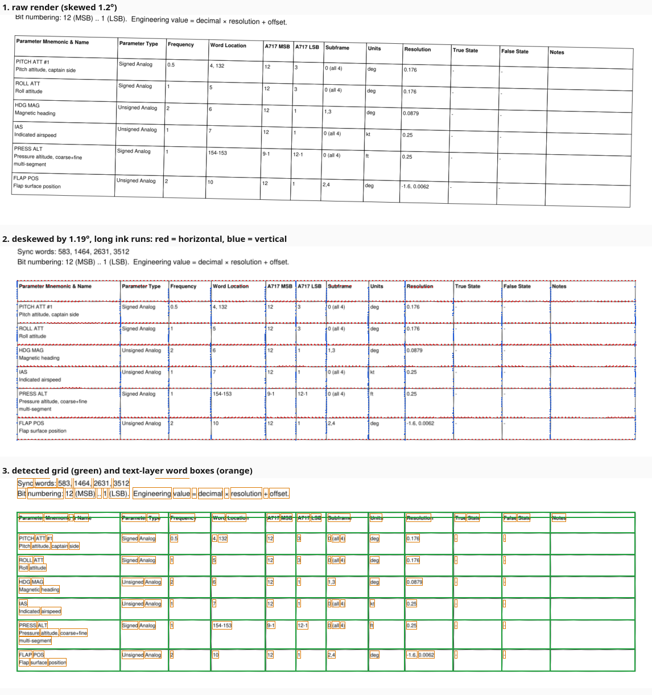

# 11 — Scanned page processing

This chapter documents the image-processing path the PDF importer takes for
scanned dataframe documents: how a page is recognised as a scan, how it is
rendered and straightened, how the ruled table is found on the pixels, where
the text comes from, how text is dropped into cells, and what is done about
recognition errors afterwards. Chapter [07 — PDF import](07-pdf-import.md)
describes the importer as a whole; this chapter goes one level deeper into
the parts that only exist because the input is an image.

The code lives in three modules of `arinc717_reader/dataframe/pdf_importer/`:

| Module | Responsibility |
| --- | --- |
| `ingest.py` | Opens the document, decides per page whether it is a scan and whether it carries a text layer. |
| `scan.py` | Everything that works on pixels: rendering, skew estimation, ruling-line detection, the OCR engine, cell assignment, second-pass recognition. Needs only numpy; OCR is loaded lazily. |
| `extract.py` | Drives the per-page path (`_scanned_page_tables`), recognises the header, builds the raw table, and decides which empty cells deserve a second OCR pass. |

Nothing in these modules interprets values. They produce verbatim cell text
with provenance; normalization and review (chapter 07) happen afterwards on
the same raw model that born-digital pages produce.

## The path at a glance

```
page ─► is it a scan?  (images cover ≥ 80 % of the page)
          │
          ▼
        render grayscale at ocr_dpi (150 by default)
          │
          ▼
        estimate skew from the long horizontal ink runs
          │  |skew| ≥ 0.03° → render again, rotated back by that angle
          ▼
        detect the ruled grid: horizontal and vertical ruling lines
          │  none → PDF_NO_GRID, page skipped
          ▼
        text boxes ──── page has a text layer ──► words of the text layer
                   └─── no text layer ──────────► RapidOCR on the RGB render
                                                  (unavailable → PDF_EXTRACTION_REVIEW_REQUIRED)
          │
          ▼
        drop every text box into the grid cell under its centre;
        join boxes into lines, lines into cell text
          │
          ▼
        header recognition, table build (shared with born-digital pages)
          │
          ▼  OCR path only
        second-pass recognition on empty cells in mapping-critical columns
          │
          ▼
        RawTable → rows → normalization → review
```



The figure is produced from a synthetic scan of the demo dataframe rotated by
1.2° (see [Verifying the pipeline](#verifying-the-pipeline)). Panel 1 is the
first render. Panel 2 is the deskewed render with the pixels that survived
the long-run opening marked: red runs are horizontal ruling lines, blue runs
vertical ones. Panel 3 shows the grid the detector assembled from those runs
and the text-layer word boxes that are dropped into it.

## 1. Deciding that a page is a scan

`ingest_pdf()` opens the file with PyMuPDF and records, for every page, its
size, its extracted text, whether that text is non-blank
(`has_text_layer`), how many images it holds, and the fraction of the page
area those images cover (`image_coverage`).

A page is treated as a scan when `image_coverage >= 0.8`
(`SCANNED_COVERAGE`). Coverage is computed from `page.get_image_info()`:
each image's bounding box is clipped to the page rectangle and its area
summed. Scanners often store the image in unrotated page space with a page
rotation applied on top, so the measurement is taken twice, once with the
boxes as reported and once with the page's rotation matrix applied, and the
larger value is used. Without this, a rotated scan could read as 0 %
coverage and fall through to the born-digital path, which would find no
tables in an image.

The two flags combine into three page kinds:

| `is_scanned` | `has_text_layer` | Path |
| --- | --- | --- |
| no | yes | Born-digital: PyMuPDF's table finder on the vector content. |
| yes | yes | Scanned with an embedded text layer (Acrobat, a scanner's own OCR): grid from the image, words from the text layer. |
| yes | no | Scanned, image only: grid from the image, words from the OCR engine. |
| no | no | Reported as `PDF_EMPTY_PAGE`, nothing extracted. |

`ImportProfile.page_range` restricts which pages are processed at all; the
real CN235 document is imported in seconds with `page_range=(3, 13)` because
those pages have a text layer, while pages 14–21 need OCR.

## 2. Rendering and the coordinate systems

`PageRaster` renders one page to a grayscale numpy array through
`page.get_pixmap(matrix=..., colorspace=csGRAY)`. The matrix is
`Matrix(zoom, zoom).prerotate(-skew_degrees)` with `zoom = dpi / 72`, so the
same object performs both the scale and the deskew rotation. The default
resolution is 150 dpi (`DEFAULT_DPI`, overridden by `ImportProfile.ocr_dpi`).

Three coordinate systems are involved and the raster keeps the transforms
between them:

| Space | Unit | Used by |
| --- | --- | --- |
| Displayed page | PDF points, page rotation applied | Every bbox that leaves the module: raw cells, provenance, "Show Source" rendering. |
| Raster pixels | pixels of the deskewed render | Grid detection, cell assignment, OCR input and output. |
| Unrotated page | PDF points before page rotation | PyMuPDF's `get_text("words")`; converted immediately with the page's rotation matrix. |

`to_pixels(bbox)` applies the raster matrix and subtracts the pixmap origin
(a rotated render has a non-zero origin because the rotated page no longer
starts at 0,0). `to_page(bbox)` is the exact inverse. Every box handed out
of `scan.py` is in displayed-page points, which is why `render_region_png`
can later show the reviewer the same region.

`rgb()` renders the page again in RGB with the same matrix; it is only
called on the OCR path, because the recognizer wants colour input and the
grayscale render is enough for everything else.

## 3. Skew estimation

Scanned pages are rarely perfectly straight. A skew of even half a degree
makes a horizontal ruling line drift across several pixel rows over the width
of an A4 page, which breaks a row-projection grid detector and makes text
boxes straddle cell borders. `render_deskewed()` therefore renders once,
measures the skew with `estimate_skew()`, and renders again rotated back by
that angle when it is at least 0.03° (`MIN_SKEW_DEGREES`).

`estimate_skew()` works only on the long horizontal ink runs, which on a
dataframe document are the table's ruling lines:

1. **Binarise.** `gray < 200` (`DARK_THRESHOLD`) marks ink. The threshold
   is deliberately generous so grey, faded rules on a photocopy still count.
2. **Keep only long horizontal runs.** A one-dimensional morphological
   opening along the x axis (`_open_1d`: erosion then dilation with a
   straight window) removes every ink feature shorter than the window. The
   window is `max(30, width // 40)` pixels (`OPENING_DIVISOR`), so at
   150 dpi on A4 landscape it is about 44 px: text strokes, glyphs and
   stamps vanish, ruling lines survive.
3. **Find the bands.** The surviving pixels are summed per pixel row; rows
   whose sum exceeds 5 % of the page width (`PROJECTION_FRACTION`) are
   grouped into bands, merging rows closer than 6 pixels.
4. **Fit each band.** For every band the surviving pixel coordinates are
   collected; bands whose horizontal extent is below 30 % of the width are
   dropped (a short rule or a signature line is not evidence for the page's
   skew). A straight line is fitted with `numpy.polyfit` and its slope
   turned into an angle.
5. **Weighted median.** The angles are combined as a median weighted by
   each rule's horizontal extent. A median rather than a mean means one
   misfit band (an underline, a folded corner) does not pull the result.
6. **Clamp.** A result above 5° (`MAX_SKEW_DEGREES`) is treated as "no
   usable rules" and returns 0: the detector is meant for scanner skew, not
   for landscape pages stored as portrait, which PyMuPDF already handles
   through page rotation.

The measurement is made on the first render and applied to the second, so
the deskewed raster's grid lines are axis-aligned to within the fit error.
The test suite checks a synthetic 0.4° skew is recovered to within 0.15°.

Only horizontal rules are used for the estimate. Vertical rules would give
the same angle on a rigid page but are shorter, fewer, and more often broken
by text touching them, so they add noise rather than precision.

## 4. Grid detection

`detect_grid()` finds the ruled table on the deskewed grayscale render and
returns a `Grid`: the sorted y positions of horizontal rules and the sorted
x positions of vertical ones. Cells are the rectangles between neighbouring
rules; there are `len(ys) - 1` rows and `len(xs) - 1` columns.

1. **Two openings.** The binarised image is opened along x (window from the
   width) and along y (window from the height), giving one image of
   horizontal runs and one of vertical runs.
2. **Horizontal rules.** Row sums of the horizontal image above 5 % of the
   width are grouped into bands (rows closer than 4 pixels merge,
   `BAND_GAP`, which absorbs a rule two or three pixels thick). A band is a
   rule only if the columns it touches span at least 40 % of the page width
   (`MIN_RULE_FRACTION`). The rule's position is the band's centre; its
   left and right extent are kept.
3. **Vertical rules.** The same on the vertical image with column sums, a
   threshold of 5 % of the height, and a minimum span of 20 % of the height
   (`MIN_VRULE_FRACTION`): column rules are shorter than row rules because a
   table rarely fills the whole page vertically.
4. **Mutual span filter.** Only rules that belong to the same table are
   kept: a horizontal rule must lie within the vertical rules' combined
   vertical span and a vertical rule within the horizontal rules' combined
   horizontal span, each with 12 pixels of tolerance. This drops title
   underlines, signature lines, logo edges and page borders that are long
   enough to pass step 2 or 3 but sit outside the table.
5. **Minimum.** Fewer than two rules in either direction means there is no
   table; the page is reported as `PDF_NO_GRID` and skipped.

`Grid.locate(x, y)` maps a pixel point to `(row, col)` with a binary search
on both rule lists; `Grid.cell(row, col)` returns the cell rectangle;
`Grid.bbox` is the whole table, used as the raw table's bounding box after
mapping back to page space.

The detector assumes one ruled table per page. If a page carries two tables
stacked vertically, their rules pass the mutual span filter together and are
read as one grid with a wide gap; the gap becomes an empty row that
`_build_table` drops, so this case usually still works. Two tables side by
side do not.

## 5. Text sources

### Embedded text layer

When the scanned page has a text layer, `text_layer_boxes()` calls
`page.get_text("words")`, multiplies every word rectangle by
`page.rotation_matrix` to bring it into displayed-page space, and discards
blank words. These boxes carry no confidence (`None`) and the source
`text_layer`. The text is trusted exactly as the scanner or Acrobat wrote
it; the importer never re-recognises a page that has a text layer, because
the embedded OCR was usually produced at the scan's native resolution and
is better than what a 150 dpi re-render would give.

### RapidOCR

Without a text layer the page goes to `RapidOcrEngine`, a thin wrapper
around `rapidocr_onnxruntime.RapidOCR` (ONNX models, CPU only, no network).
It is an optional dependency: `pip install rapidocr-onnxruntime` or
`.[ocr]`.

RapidOCR is three networks: a text *detector* (where are the lines), an
*angle classifier* (is a line upside down) and a *recognizer* (which
characters). The importer configures them as follows; every choice was
measured with `tools/ocr_bench.py` (section 13):

- **Recognizer: English PP-OCRv3** (`ImportProfile.ocr_recognizer = "en"`,
  the default), bundled in `pdf_importer/models/` (Apache 2.0, 9 MB, its
  95-character list embedded in the file). RapidOCR's own recognizer is
  trained on Chinese plus Latin: it returns a lone `0` as the CJK full stop
  `。`, drops spaces and confuses more digits. It stays available as
  `ocr_recognizer = "ch"`, and any recognizer ONNX file can be named by
  path (with `ocr_keys_path` when the file does not embed its characters).
- **Angle classifier off** (`ocr_angle_classifier = False`). The page is
  already deskewed and a table has no upside-down lines, whereas the
  classifier flips short crops: `ON` → `NO`, `90` → `06`, `9` → `6`.
- **Recognition per grid cell** (`ocr_cells = True`, the default) instead
  of page-level text detection.

`recognize_cells()` reads every cell of the detected grid on its own crop:
the cell rectangle inset from the ruling lines (`cell_inset(dpi)`: 3 px at
150 dpi, 5 px at 300), trimmed of rule residue (`strip_rule_residue()`
removes border rows and columns that are more than half ink), skipped when
it holds fewer than 12 dark pixels (`has_ink()`), otherwise split into text
lines by its ink profile (`_ink_line_bands()`, each line cropped to its ink
and padded with 4 white pixels) and recognised line by line with
`recognize_cell()`. The cell's text is the lines joined with newlines, its
confidence the lowest line score, its source `ocr`. Nothing is detected on
the page, so a lone `0` or a `-40` is read like any other cell and text can
never land in a neighbouring cell.

The older path (`ocr_cells = False`) is kept for comparison: `recognize(rgb)`
runs the detector and the recognizer on the whole render, each result box
is reduced to its axis-aligned bounding box, mapped back to displayed-page
points by `ocr_boxes()` and dropped into the cell under its centre, and the
empty mapped cells get the second pass of section 8. It is slower and less
accurate: the detector works on a downscaled page and misses isolated
glyphs, at high resolution it splits or duplicates boxes, and a box can
straddle two cells.

The engine is created once per import by `_OcrHolder` in `extract.py`, on
the first page that needs it, and its failure is remembered so a missing
package is reported once per page rather than retried. With
`ImportProfile.ocr = "never"` the engine is never created and image-only
pages are reported as `PDF_EXTRACTION_REVIEW_REQUIRED` with the reason in the
message. The same code is emitted when the package is not installed. Either
way the page is reported, never silently skipped, and the session still
imports the other pages.

Recognition runs at the render resolution, `ocr_dpi`, 200 by default: on
the benchmark 150 dpi loses about two points of cell accuracy and 300 dpi
gains nothing worth its extra time. A page takes about 7–9 s on a CPU at
200 dpi with per-cell recognition (page detection took 12–15 s, most of it
in the full-page detector and the second passes). The recognizer, the
resolution and the mode used are recorded as the info issue
`PDF_OCR_ENGINE` in the review dialog's Document box.

## 6. Dropping text boxes into cells

`grid_cells()` assigns every text box to the grid cell under the box's
centre point (`Grid.locate` on the pixel-space centre). Using the centre
rather than a corner makes the assignment robust against boxes that
slightly overlap a ruling line, which OCR boxes and text-layer word boxes
both do.

Inside a cell, `_cell_text()` rebuilds the reading order:

1. Boxes are sorted by top edge, then left edge.
2. Boxes are grouped into lines by vertical overlap: a box starts a new
   line when its top is below the current line's bottom minus 30 % of the
   box's own height. This tolerates the ragged baselines OCR produces while
   still separating stacked text such as a mnemonic over its name.
3. Within a line, boxes are ordered left to right and joined with single
   spaces; lines are joined with newlines.

Line breaks are preserved on purpose. The normalizer relies on them: the
first line of a "Parameter Mnemonic & Name" cell is the mnemonic and the
rest is the name; a multi-line "True State" cell lists the states of a
multi-bit discrete; a word-location cell wrapped over two lines still parses
as one list.

Each resulting `RawCell` records:

| Field | Value |
| --- | --- |
| `text` | The joined cell text, possibly empty. |
| `bbox` | The grid cell rectangle in displayed-page points (not the text's own box), so "Show Source" frames the whole cell. |
| `confidence` | The minimum confidence of the boxes in the cell, or `None` for text-layer cells. |
| `source` | `ocr` if any box in the cell came from OCR, else `text_layer`. |
| `grid_cell` | `(row, col)`, kept so the second pass can find the cell's pixels again. |

The table's strategy string records the path taken, for example
`scan+text_layer (deskewed 0.41°)` or `scan+ocr`, and is shown in the
review dialog's row details.

## 7. Header recognition and table assembly

From here the scanned page joins the born-digital path. `_build_table()`
takes the first non-empty grid row and asks `map_columns()` whether it is a
parameter header: at least three recognised columns, including a name column
and a word-location column. Header cells are matched against the synonym
table exactly first, then fuzzily with a similarity ratio of at least 0.75
(`FUZZY_HEADER_RATIO`) so OCR noise such as "Parameter Tvpe" or a missing
space in "WordLocation" still maps. Fuzzy matches never overwrite an exact
match and never claim a column an exact match already took, which keeps
"MSB" and "LSB" apart.

When the first row is not a header, the previous table's header is inherited
if the column count matches, so a table continued on the next page keeps its
mapping. Otherwise the table is reported as `PDF_TABLE_SKIPPED` with the row
text, and nothing is guessed. Rows that repeat the header inside a long table
are dropped; entirely empty rows are dropped.

`rows_from_tables()` then flattens the tables and merges continuation rows:
a row with no structural cell (word, type, bits, frequency, resolution) but
with text in a continuation column (name, description, states, notes) is the
tail of the previous row split by a page break, and is appended to it with a
note. This is how a state list that runs from page 12 to page 14 of the CN235
document ends up on one parameter.

## 8. Second-pass recognition on empty cells (page-detection mode)

With per-cell recognition (the default, section 5) every cell with ink is
read directly and no second pass is needed. This section describes the
fallback that the page-detection mode (`ocr_cells = False`) relies on.

Text detectors are trained on lines of text and routinely miss isolated
small glyphs: a lone "0" or "1" in a Subframe or LSB column, a "3" in a
narrow cell. Such cells come out empty, and an empty subframe or bit cell
would send every affected row to review or make it unrepresentable.

After the table is built, `_scanned_page_tables()` collects every empty cell
in a mapped column and hands them to `second_pass_cells()`, which recognises
them without detection, using the same crop preparation as per-cell
recognition:

1. The cell rectangle is cropped from the RGB render, inset from the ruling
   lines by `cell_inset(dpi)` pixels and trimmed of rule residue. Crops
   smaller than 6 pixels in either direction are skipped.
2. Cells with fewer than 12 dark pixels (`MIN_CELL_INK_PIXELS`) are
   considered blank and left empty, so a genuinely empty cell never gains
   text. The count is absolute so that a thin "1" still counts at 300 dpi,
   where a fraction of the (larger) cell would not.
3. `_ink_line_bands()` splits the crop into its text lines with a
   horizontal ink projection (rows with ink, gaps of up to 2 pixels merged,
   bands shorter than 5 pixels ignored, 2 pixels of margin added, each line
   cropped to its ink and padded white), so a cell with two lines is
   recognised line by line.
4. Each band goes to the recognizer alone (`use_det=False`,
   `use_cls=False`). The texts are joined with newlines and the cell's
   confidence is the lowest line score.
5. The cell's source becomes `ocr` and its note records
   `second-pass OCR on the cell crop (detector found no text)`; the
   normalizer turns that note into an info issue on the row so the reviewer
   knows the value came from the fallback.

Text-layer pages are taken as they are in either mode.

## 9. What the raw model carries forward

Every cell keeps its page number, bounding box in page points, verbatim
text, text source, confidence and second-pass note. `row_from_cells()`
copies these into `RawFieldProvenance` per mapped field and into the row's
own `bbox` (the union of its cells), `columns`, `cells` and `text_source`.
The normalizer stores them in `ParameterProvenance.extra` (`page`, `bbox`,
`raw_fields`, `confidence`, `text_source`, `interpretation`) so a published
parameter can always answer where each value came from, and the review
dialog's "Show Source" renders the row's region of the page with the row
outlined.

## 10. Handling recognition errors downstream

The image stage never corrects text. Corrections happen in the normalizer,
where every one is reported as an issue and therefore reviewable
(chapter 07, "OCR corrections"). The rules that exist because the input was
an image are:

| Situation | Rule | Outcome |
| --- | --- | --- |
| A digit read as a letter or symbol (`O`→`0`, `l`/`I`/`\|`→`1`, `S`→`5`, `B`→`8`, `Z`→`2`, `g`→`9`, and the CJK full stop `。` RapidOCR produces for a lone `0`) | `ocr_digit_repair`, tried only when the cell does not parse as written | Warning `*_repaired` with the original and repaired text. |
| Stamp or rule fragments read as punctuation next to a number (`-- 1`, `~ 0.5`) | `ocr_junk_strip` | Warning `*_repaired`. |
| A dash read as a dot in a range (`9.1`, `16.17`) | `_DOT_RANGE` in bit and word cells | Read as a range, reported through the layout interpretation. |
| A type word split or misread (`Discret e`, `BCO`) | joined-text lookup, then closest known type word at ratio ≥ 0.66 | Warning `normalize.type_repaired`. |
| A critical field with OCR confidence below `ocr_confidence_threshold` (0.6) | confidence check per field | Warning `normalize.ocr_confidence` naming the field and score. |
| Text from OCR or a text layer at all | text-source note | Info `normalize.ocr`, so the review table shows which rows were never typed by a human. |

A row with any of the warnings above goes to review; the reviewer confirms
it against "Show Source" or edits it. Names are not repaired: RapidOCR often
drops the spaces inside a line (`PitchAttitude#1`), and fixing a name is the
reviewer's job, not the importer's.

## 11. Issues the image path can emit

| Code | Severity | When |
| --- | --- | --- |
| `PDF_SCANNED` | info | Any page is a scan; the message counts scanned pages and how many have a text layer. |
| `PDF_NO_GRID` | warning | A scanned page has no detectable ruled table. |
| `PDF_EXTRACTION_REVIEW_REQUIRED` | error | A scanned page has no text layer and OCR is disabled or unavailable; nothing was extracted from it. |
| `PDF_EMPTY_PAGE` | warning | A page has neither text nor a page image. |
| `PDF_TABLE_SKIPPED` | warning | The grid was found but its first row is not a recognisable header and no header could be inherited. |
| `PDF_OCR_ENGINE` | info | OCR was used; the message names the recognizer, the resolution and the mode (`per grid cell` or `page text detection`). |

Document-level issues are listed in the review dialog's Document box.
`PDF_EXTRACTION_REVIEW_REQUIRED` does not block publishing the rows that
were extracted; it tells the reviewer that a page is missing.

## 12. Tuning

Profile settings (`ImportProfile`, set in code or through the review
dialog's conventions box):

| Setting | Default | Effect on the image path |
| --- | --- | --- |
| `ocr` | `auto` | `never` disables the engine; image-only pages are reported instead of read. |
| `ocr_dpi` | 200 | Render resolution for skew, grid and OCR. 150 loses about two points of cell accuracy; 300 costs time for no measurable gain. |
| `ocr_recognizer` | `en` | Recognizer model: `en` (bundled English PP-OCRv3), `ch` (RapidOCR's Chinese-plus-Latin model) or the path of a recognizer ONNX file (`ocr_keys_path` names its character list if the file lacks one). |
| `ocr_angle_classifier` | false | RapidOCR's 180° line classifier. Leave it off for deskewed tables; it flips short crops. |
| `ocr_cells` | true | Recognise each grid cell on its own crop. `false` selects page-level text detection with the second pass of section 8. |
| `ocr_confidence_threshold` | 0.6 | Below this a critical field is flagged for review. Raise it for a poor scan, lower it for a clean one. |
| `page_range` | all pages | Process only these pages; the fastest way to skip pages that need OCR. |

Constants in `scan.py`, changed only when a document defeats the defaults:

| Constant | Default | Raise it when | Lower it when |
| --- | --- | --- | --- |
| `DARK_THRESHOLD` | 200 | Rules are faint and drop out of the binarised image. | Grey paper texture or bleed-through is read as ink. |
| `OPENING_DIVISOR` | 40 | Long underlines in cell text survive the opening and are taken for rules. | Short rules (narrow tables) are removed by the opening. |
| `PROJECTION_FRACTION` | 0.05 | Text baselines are detected as rules. | Rules broken into dashes fall below the threshold. |
| `BAND_GAP` | 4 | Thick or doubled rules are detected twice. | Two closely spaced rules merge into one. |
| `MIN_RULE_FRACTION` / `MIN_VRULE_FRACTION` | 0.4 / 0.2 | Non-table lines are accepted as rules. | The table is narrow or short on the page. |
| `MAX_SKEW_DEGREES` | 5 | A scan is more crooked than 5° (rare; the estimate is then trusted). | Never in practice. |
| `CELL_INSET` | 3 at 150 dpi (`cell_inset()` scales it with the resolution) | Rule pixels leak into cell crops. | Thin cells lose their glyphs. |
| `RULE_RESIDUE` | 0.5 | Border rows / columns of rule residue survive into the crop. | Dense text at a cell edge is trimmed away. |
| `MIN_CELL_INK_PIXELS` | 12 | Speckle noise is recognised as text in blank cells. | A single thin glyph is treated as blank. |
| `LINE_PAD` | 4 | Glyphs touching the crop edge are misread. | Never in practice. |

## 13. Accuracy: what helps and what does not work

### Measured

`tools/ocr_bench.py` renders a 48-parameter dataframe with many numeric
cells as image-only scans (200 dpi image, 6.5 pt print, 0.6° skew) in the
generic and the FDS layouts, runs the scanned-page pipeline and compares
every cell with the known truth: *exact* is the share of cells whose text is
identical after whitespace normalisation, *CER* the character error rate.
The settings were changed one at a time (96 rows, about 1,300 cells):

| Pipeline | Generic exact | FDS exact | CER generic / FDS | s per page |
| --- | --- | --- | --- | --- |
| Default RapidOCR recognizer, page detection, angle classifier on, 150 dpi (before) | 87.2 % | 85.1 % | 7.8 % / 6.5 % | 15 / 11 |
| English recognizer, otherwise the same | 94.0 % | 92.5 % | 4.6 % / 5.4 % | 12 / 10 |
| + angle classifier off | 95.8 % | 93.8 % | 3.1 % / 4.5 % | 14 / 11 |
| + 200 dpi | 97.3 % | 95.3 % | 1.9 % / 4.2 % | 13 / 12 |
| + per-cell recognition (**the default now**) | 99.7 % | 99.1 % | 0.08 % / 0.12 % | 8.5 / 6.6 |
| the same at 300 dpi | 99.6 % | 99.7 % | 0.07 % / 0.07 % | 9.1 / 8.2 |

What remains at the default settings is `lb/h` read as `Ib/h`, `WOW` as
`WoW` and one `0 (all 4)` as `0 (ll 4)`: shape ambiguities of the typeface,
not detection failures. Synthetic renders are cleaner than a real scan, so
treat the absolute numbers as an upper bound; the differences between the
rows are what the benchmark is for. Run it after any change to `scan.py`:

```bash
.venv/bin/python tools/ocr_bench.py                          # defaults
.venv/bin/python tools/ocr_bench.py --rec ch --page-detector  # the old path
.venv/bin/python tools/ocr_bench.py --real examples/FDS81.pdf --pages 14-21
```

What helps:

- Scan at 300 dpi or better, straight, with the table's ruling lines dark
  and continuous. The grid detector needs the rules; OCR needs the glyphs.
- Prefer a scan with an embedded text layer from the scanner or Acrobat. The
  importer trusts it and imports in seconds, and its recognition is usually
  better than a re-render.
- Declare the document's conventions (frequency unit, MSB/LSB layout,
  resolution pair order) so review effort goes to recognition doubts rather
  than to interpretation doubts.
- Use "Show Source" on every repaired value; that is what the repair
  warnings are for.

Known limitations of the current implementation:

- **Ruled tables only.** A table drawn without vertical lines, or with only
  a header rule, yields no grid. Tables laid out purely with whitespace are
  handled on born-digital pages by PyMuPDF's text strategy, not on scans.
- **One table per page**, as described in section 4.
- **Skew only, no dewarp.** A page photographed at an angle, or a book
  scan with curved lines, is not corrected; rules that are not straight are
  fitted as one line and the residual error lands in cell assignment.
- **Skew from horizontal rules only.** A page whose only long rules are
  vertical gets no skew correction.
- **Merged cells** spanning several columns or rows are not modelled; their
  text is assigned to the one cell under its centre.
- **Text layers are trusted.** A scanner's OCR errors are inherited and
  carry no confidence score, so the confidence check does not apply to them;
  the digit and junk repairs still do.
- **Rotation is the page's business.** A landscape table stored as a
  portrait page with a 90° page rotation is fine; a portrait page whose
  image content is rotated 90° without a page rotation flag is not
  recognised, because the skew estimator gives up above 5°.
- **Time.** OCR is CPU-bound at roughly 7–9 s per page at 200 dpi; there is
  no GPU path and no caching between imports.

## Verifying the pipeline

`synth.py` writes any dataframe as a dataframe document and can emit it as a
scan: `scanned="image"` embeds a page image without text,
`scanned="text_layer"` adds the words back as invisible text at their rotated
positions (like an Acrobat layer), and `skew_degrees` rotates the page image.
This gives a closed loop with a known answer:

```python
from arinc717_reader.demo import build_demo_dataframe
from arinc717_reader.dataframe.pdf_importer import ImportProfile, import_pdf
from arinc717_reader.dataframe.pdf_importer.synth import write_dataframe_pdf

path = write_dataframe_pdf(
    build_demo_dataframe(), "scan.pdf", style="fds", rows_per_page=7,
    scanned="text_layer", skew_degrees=0.4,
)
session = import_pdf(path, ImportProfile(multiword_bits="range_per_word",
                                         resolution_pair="offset_resolution"))
```

The tests that cover this chapter:

| Test | What it checks |
| --- | --- |
| `tests/test_pdf_scan.py::test_scanned_page_with_text_layer_round_trips` | Skew recovered within 0.15°, grid has the document's column count and header + rows, every row comes from the text layer, publish reproduces the dataframe. |
| `tests/test_pdf_scan.py::test_scanned_page_without_grid_is_reported` | A prose scan yields `PDF_NO_GRID` and no rows. |
| `tests/test_pdf_scan.py::test_scanned_image_only_page_is_read_by_ocr` | Image-only scan at 200 dpi through RapidOCR (skipped when the package is missing). |
| `tests/test_pdf_scan.py::test_continuation_rows_are_merged` | Page-break continuation merge. |
| `tests/test_real_document.py::test_text_layer_pages` | The CN235 document's text-layer pages: 11 tables, 190–200 rows, detected conventions, specific rows. |
| `tests/test_real_document.py::test_full_document_with_ocr` | The whole CN235 document with OCR; run with `ARINC717_OCR_TESTS=1`. |

To look at what the detector sees on a page, render the page through
`PageRaster`, call `estimate_skew` and `detect_grid` yourself and draw
`grid.ys` / `grid.xs` over `raster.gray`; the figure at the top of this
chapter was produced that way. The raw table's `strategy` string and each
cell's `source`, `confidence` and `note` are shown in the review dialog's
row details, and "Show Source" renders the region so a doubtful cell can be
compared with the pixels it was read from.
